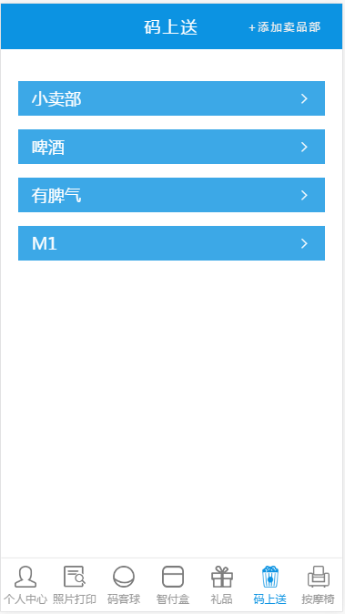
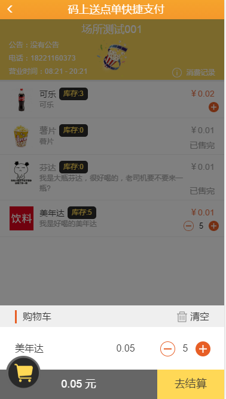
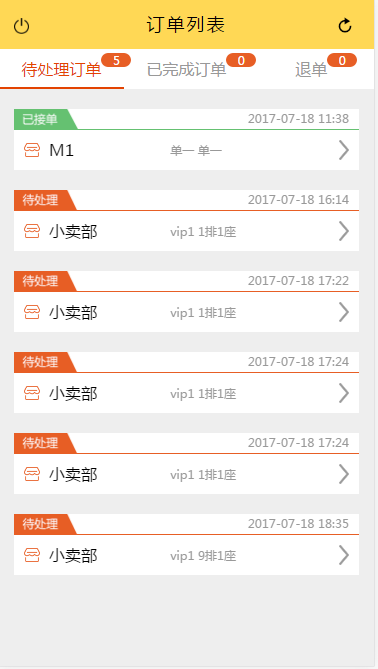
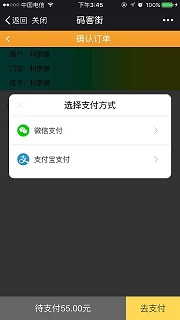
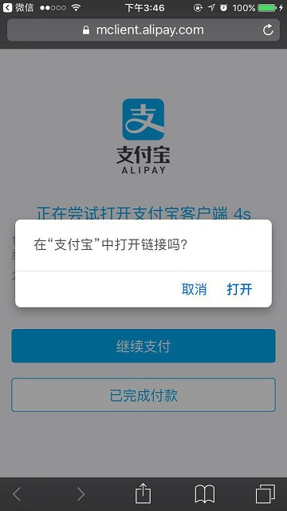
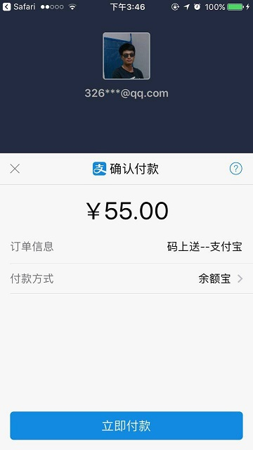
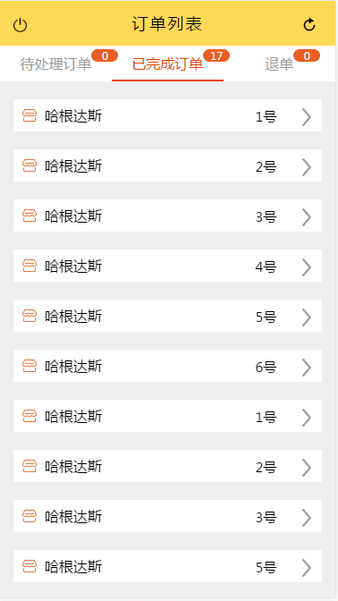

###　码上送项目：

> 码客街和电影院合作的在线点餐业务

##### 项目架构
 1. 码客街管理后台
    - 在后台控制，每个场所码上送系统的开启与否以及新增码上送场所

    

 2. 推广员系统（影院管理后台）
   - 每个影院一个账号，可在此账号下，管理本影院码上送系统内的商品

   

   此部分有分 3个板块
   1. 基本信息
   2. 商品管理 （商品的 增，删，改）
   3. 二维码管理 （根据影院座位号，生成对应的二维码，扫码，点餐，支付）

 3. 支付页面（码客街公众号）
    - 码客街公众号码上送商品支付页面

    

 4. 码上送接单系统（放在移动终端打印机上，安卓机器上）
   - 能够自动接收用户提交的订单，并提示商家接单，小票打印功能

   

  ### 总结
  1. 第一次使用 vue.js 体验到了 mvvm 数据驱动的魅力
  2. 引入方式： 只是用 script 引入了的 vue.js 单文件
  3. 在原来内部框架的基础上，用 require.js 引入了 vue.js 并没有使用 vue 全家桶
  4. 
  ### 遇到的问题：
  - 有用户支付时，移动终端会自动发出声音，有新的订单，此时需要客户端有一个轮询访问
  - 我使用 setTimeout 每隔一段时间 就向后台访问一次，获取有没有订单产生，如果有 就调用 安卓提供的 lee.sound() 方法，让移动终端发出声音
  - 如果没有订单就什么都不做
  - 此处做了一些优化，当每次轮询访问时，如果没有订单产生，下次轮询时间会增长，但是有一个峰值
  ### 老项目带来的坑
  - 如果是新用户扫码进来不会进入 商品选择页面而是进入，码客街公众号页面
  - 一直没有找到原因，最后发现原来是系统遗留的历史问题
  - 码客街有两个公众号：1.码客街 2.蜂马网络
  - 据说当时申请公众号的时候，支付选项配置错了，故有申请了一个公众号用于支付
  - 码上送项目配置前端路由的时候忘记这茬事了，最终和后台一起把路由配置正确了
  - 成功的解决了这个问题，历史遗留问题真严重啊

#### 后记
1. 本来该产品是供影院使用，但是 老板接了个活 （2017-08-05 -- 2017-08-06 天猫音乐节的活动）
2. 老板成功的把码上送产品，投入到生产环境，而且这是一个大型活动
3. 此活动带来的产品需求
- 码上送产品需要支持支付宝支付（但我们最初产品的设计是放在微信公众号上面的，我累个擦）
- 但老板命令难违啊
- 我们想到了一个投机取巧的办法
- 在去支付的按钮上弹出一个列表选择，1.微信 2.支付宝
- 微信支付还是原来的微信
- 在选择的支付宝的支付的时候，跳转到一个新的 html页面，并在 url上附带上 支付订单号
- 然后引导用户用浏览器打开 
- 在外部浏览器上用订单号==>发起支付宝支付，继而完成整个支付流程
- 详情请查看支付宝支付文档

### 现场活动图片

### 接下来准备优化迭代项目
1. 将接单系统 setTimeout 轮询请求新数据，改为服务器推送消息（websocket）

